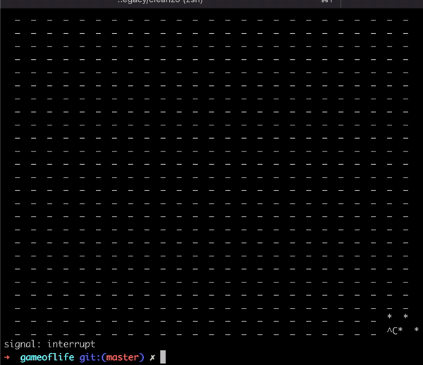

## Dependencies
- go (any version)

## How to run

0. `git clone https://github.com/x0st/gameoflife.git gameoflife`
1. `cd gameoflife`
2. Navigate to the `main.go` file
3. Uncomment the solution you want to run
4. `go run .`

## Demo
